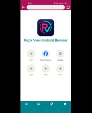
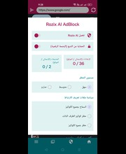

# Rozix View

Rozix View is a modern Android web browser focused on privacy, security, and performance.

Built with Chromium WebView, Rozix View includes AI-powered ad blocking to provide a faster and cleaner browsing experience.

## Features

- 🌐 Fast and lightweight browser
- 🤖 AI-powered AdBlock
- 🛡️ Privacy-focused browsing
- 🍪 Cookie management
- 📱 Modern Material Design interface
- ⚡ Smooth browsing experience

## Screenshots

  
  
  

## AI AdBlock

Rozix AI AdBlock uses a locally deployed ONNX machine learning model to detect and block advertising content without relying on external services.

## Technology

- Kotlin
- Android SDK
- Chromium WebView
- ONNX Runtime
- Material Design

## Developer

Developed by **Rozix Systems**

GitHub: https://github.com/sherifmousa707-droid
